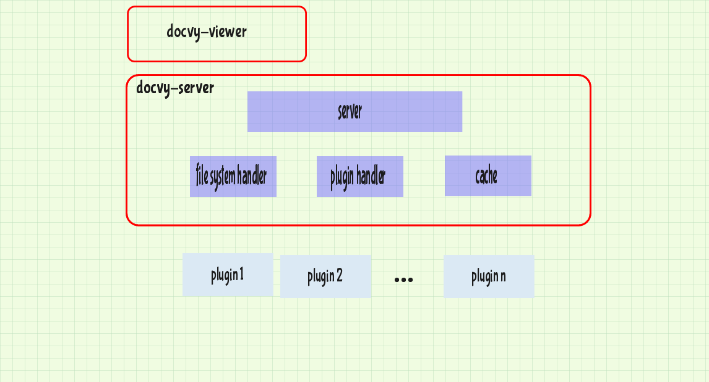

# Application Architecture

The Application has been divided into two main components:

1. docvy-server ([component url](https://github.com/docvy/server))
* docvy-viewer ([component url](https://github.com/docvy/viewer))

## 1. docvy-server

This component is further sub-divided into:

* server ([module url](https://github.com/docvy/server/blob/develop/lib/server.js)):

  * exposing a well-defined API for the system
  * pre-processing user requests

* file-system handler ([module url](https://github.com/docvy/server/blob/develop/lib/fs.js)):

  * traversing the file system
  * reading files

* plugin handler ([module url](https://github.com/docvy/server/blob/develop/lib/plugins.js)):

  * registering plugins
  * installing plugins
  * running plugins
  * retrieving information of plugins

* cache ([module url](https://github.com/docvy/server/blob/develop/lib/cache.js)):

  * caching converted data from raw files

## 2. docvy-viewer

This component presents a user interface, friendly enough to the user. It  emulates a web application.

## More:

To improve the sketch/drawing of the architecture shown above:

1. clone this doc repo: `git clone https://github.com/docvy/devbook.git`
* head over to https://sketch.io/sketchpad/
* open the **arch.sketchpad** with the application
* make changes
* save as a PNG image named **arch.png**
* `git add` both arch.sketchpad and arch.png
* `git commit` the changes
* `git push` to see the changes here

